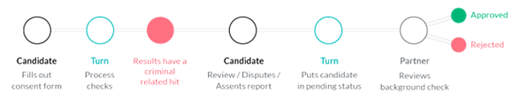

#  Common Background Check flows
A background check consists of 3 phases: gathering, processing and reviewing.

**Gathering** The candidate provides all the information required and consents to be background screened.

**Processing** The time required to complete all the selected checks in the package designed by an employer. We can run a basic background check in 1.1 seconds, but complete turnaround times are dependent on both the type of package selected and the nuances of a candidate’s history. County checks tend to be the most time consuming. We have a dedicated internal compliance team to ensure processing times are always kept at a minimum.

**Reviewing** Once a background check is complete, the results fall into two categories: 1) The results come back as clear or 2) the results need to be reviewed due to a hit or data discrepancy and normally involve work between our compliance team and the candidate.

## The Candidate Experience
We create a streamlined experience to get candidates through the funnel as quickly as possible.

1.  Designed our own proprietary communication protocol that combines email and SMS outreach to get an application started.
2.  Prepopulate candidate’s information in the background check form to streamline data input.
3.  Utilize a smart form and display a series of disclosures depending on the candidate’s state residency.
4.  Candidate’s provide consent.
5.  Background check is performed.

If a candidate’s check comes back clear, we will send them a copy of the report for their records. They then continue on in an employer’s onboarding funnel.

If their background check reveals a criminal hit, we let them know about the record found and provide them an opportunity to dispute the claim. Once the report is assented

## The Hiring Manager Experience
When a background check is clear on a candidate, the flow is as follows from the hiring manager perspective:

1.  **a) Below is the case if the background checks surfaces a criminal hit:**  
    
2.  **b) Below is the case if the background checks surfaces non-criminal related hits:**  
    

## Background Check Status
Now that we understand the process and flow of a background check, lets review all the different candidates statuses in the Turn Dashboard.

### Emailed

A candidate is just added to the dashboard via the Add Candidate feature or using the API. Turn will send a personalized invitation to run a background check. This invitation will work only once, and reminders will be sent via email and sms (if a phone number is provided) to guide the candidate through the background check process.

### Processing

There are parts of the background check that are still being processed such as county criminal checks or an MVR. We display which checks are done and which checks are still currently being processed.

### Reviewing

The data in the application was flagged due to information mismatch or inaccuracies. Our QA team will work directly with the candidate to update their data to resume the check.

### Consent

All checks are done processing. If potentially negative information is obtained from the background checks, we provide the candidate an opportunity to dispute any inaccurate or incomplete information, as required by FCRA. An applicant who disputes their background check results will have the Consent status while Turn reinvestigates. Also, applicants whose confirmation of their results is pending shall remain in Consent status.

### Pending

The background check is ready, but we flagged potential information that could be a stopper in your hiring process. The pending status report should be reviewed by an employer’s hiring manager, as they are responsible for the final decision of approving or rejecting a candidate.

### Approved

A candidate is approved.

### Rejected

A candidate is rejected.

### First Notice

A first notice is sent when an employer decides to initiate adverse action against a candidate (explained further in the Compliance section below). This legally mandated requirement offers the candidate a chance to dispute any information they consider inaccurate or incomplete.

### Second Notice

If a candidate fails to respond to the first notice within a reasonable time (seven business days), then a second notice is sent to the candidate, notifying them that their candidacy is rejected.

### Withdraw

If a background check is stalled because either the employer or the candidate no longer wish to continue the process, then the status is considered withdrawn and is archived as a non-completed check.

## Sequencing of Checks
Turn is able to implement certain rules to optimize the cost of background checks. For example, if an employer creates a candidate package that includes a Basic check, MVR check, and a 7 year county criminal search, our platform allows the employer to sequence the order of those checks to filter out candidates that fail earlier in the process.

Here’s an example of how an employer could define a rule for check sequencing:

1.  Run MVR first, then Basic, then 7 year county search.
2.  If the MVR is either clear or reviewed by a hiring manager, run all pending checks.
3.  If the MVR is not clear, stop all pending checks, and proceed with Adverse Action. This type of sequencing would prevent the employer from incurring the cost of triggering all pending checks.

